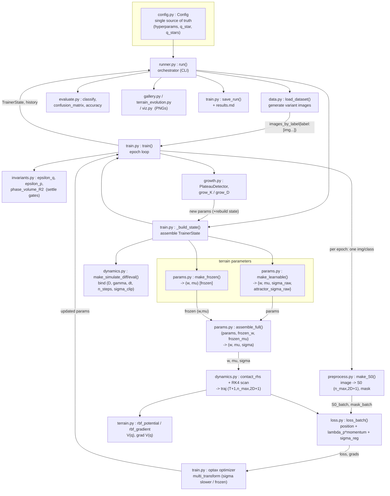

# CHM (FINAL) — pipeline structure & inter-file data flow

How the files cooperate during one experiment, in execution order:
**data generation → preprocessing → terrain → simulation → training → evaluation**.

---

## 1. Execution-order flow

`main.py` is an alternate CLI entry (`train/evaluate/demo`) that drives the
same `train()` / `evaluate` path without the runner's calibration + reports.

---

## 2. File roles by pipeline stage

| stage | file | role | key entry points |
|---|---|---|---|
| **config** | `config.py` | single source of truth for every hyperparameter; computes attractor targets `q_star(label,D)` / `q_stars(D)`; honors `attractor_override` | `Config`, `with_dataset`, `q_stars` |
| **(0) orchestration** | `runner.py` | CLI: validate -> live time calibration -> gallery -> train -> terrain viz -> eval -> `results.md` | `run`, `_calibrate`, `_improved_attractor_preset` |
| **(1) data generation** | `data.py` | parametric O/X, A/B/C, a/b/c/d generators; `DATASETS` registry (image size, class labels, attractor positions/z, n_max) | `load_dataset`, `DATASETS` |
| **(2) preprocessing** | `preprocess.py` | pixels>tau -> particles lifted to R^D; pad to `n_max`; `mask` marks real particles | `make_S0`, `preprocess` |
| **(3) terrain params** | `params.py` | 3 RBF blocks: frozen attractors (w,mu), stepping stones, free basis; learnable `attractor_sigma_raw`; reassembles full (w,mu,sigma) | `make_frozen`, `make_learnable`, `assemble_full` |
| **(3) terrain field** | `terrain.py` | the potential `V(q)=sum_k w_k exp(-||q-mu_k||^2/2 sigma_k^2)` and its analytic gradient | `rbf_potential`, `rbf_gradient` |
| **(4) simulation** | `dynamics.py` | contact eqns dq/dp/dz, fixed-step RK4 inside `lax.scan`; checkpointed (diff) / plain (eval) | `contact_rhs`, `make_simulate_diff/eval`, `split_traj` |
| **(5) loss** | `loss.py` | mask-aware CoM-to-target + residual-momentum + weak attractor-sigma L2 | `loss_batch`, `forward_and_metrics` |
| **(5) training** | `train.py` | epoch loop: sample -> value_and_grad(loss) -> optimizer -> diagnostics -> growth -> snapshot; rebuilds state on growth | `train`, `_build_state`, `save_run` |
| **(5) gates** | `invariants.py` | eps_q (CoM-target dist), eps_p (residual speed), phase-volume R^2 vs -D*gamma*t | `epsilon_q/p`, `phase_volume_R2` |
| **(5) growth** | `growth.py` | plateau detection; grow_K (more RBFs) / grow_D (one more dim, sqrt(D) sigma scale incl. attractor sigma) | `PlateauDetector`, `grow_K`, `grow_D` |
| **(6) evaluation** | `evaluate.py` | forward-only classify (argmin CoM-to-attractor); accuracy, confusion, sweeps, ablation | `classify`, `confusion_matrix`, `accuracy` |
| **(7) viz** | `gallery.py`, `terrain_evolution.py`, `viz.py` | dataset gallery PNG; 3D V(x,y) terrain time-evolution; summary figure | `make_dataset_gallery`, `make_terrain_evolution_3d`, `summary_figure` |

---

## 3. Inter-file parameter / variable exchange

Producer -> object -> consumer(s):

| object (shape / type) | produced by | consumed by |
|---|---|---|
| `cfg` (Config) | `config.py` | **all** modules (hyperparams, q_stars, tau, n_max, n_steps) |
| `images_by_label` `{label:[HxW]}` | `data.load_dataset` | `train._sample_batch`, `runner` (gallery/eval) |
| `S0` (n_max, 2D+1), `mask` (n_max,) | `preprocess.make_S0` | `dynamics.simulate_*`, `loss`, `train`, `evaluate` |
| `frozen` = (w (C,), mu (C,D)) | `params.make_frozen` | `assemble_full`, stored in `TrainerState.frozen` |
| `params` {w (Kl,), mu (Kl,D), sigma_raw (Kl,), attractor_sigma_raw (C,)} | `params.make_learnable` / growth | `assemble_full`, optimizer, `save_run` |
| `(w, mu, sigma)` full (K=C+Kl) | `params.assemble_full` | `terrain.rbf_*` via `dynamics` |
| `traj` (T+1, n_max, 2D+1) | `dynamics.simulate_*` | `loss`, `invariants`, `evaluate`, `terrain_evolution` |
| `q_stars` (C, D) | `config.q_stars` | `loss_batch` (target), `evaluate`/`invariants` (eps_q) |
| `loss`, `grads` | `loss_batch` via `value_and_grad` | `train` optimizer step |
| `diag` {eps_q,eps_p,R2 per class} | `invariants` via `train._diagnostics` | settle check, `grow_K` guided placement |
| `TrainerState` (D,K_learn,params,frozen,sims,opt_state,grad_fn,q_stars,labels) | `train._build_state` | `train` loop, `evaluate`, `viz`, `runner` |
| `history` {loss,epoch,diag,events,terrain_snapshots} | `train.train` | `runner` (results), `terrain_evolution`, `save_run` |

### Notes on the B + learnable-sigma wiring
- Attractor **sigma** left the frozen block: `make_frozen` returns only `(w,mu)`;
  `assemble_full(params, frozen_w, frozen_mu)` rebuilds sigma's first C slots
  from `params["attractor_sigma_raw"]` so it stays index-aligned with `(w,mu)`.
- `train._make_optimizer` routes `attractor_sigma_raw` through `optax.multi_transform`:
  slower LR (`attractor_sigma_lr_scale`) when learning, `set_to_zero` when frozen.
- `loss_batch` adds `lambda_attractor_sigma * ||sigma - sigma_init||^2`.
- `grow_D` scales `attractor_sigma_raw` by `sqrt(D_new/D_old)`; `grow_K` passes it through.
- The improved attractor layout is a Config-level override (`attractor_override`,
  `frozen_w`, `attractor_sigma_init`) — the global `DATASETS` registry is never mutated.
